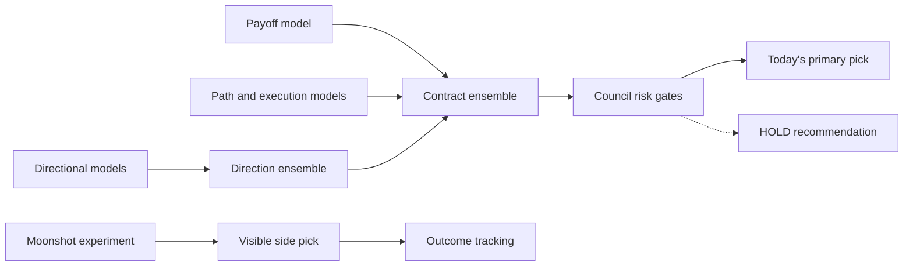

# ADR 0001: One production lane

- Status: accepted
- Date: 2026-08-12
- Decision owner: Orographic

## Decision

Orographic has exactly one production candidate and order-authority path:

`Scout → Sentinel → Forge unified rank → Council → council.live_board → broker`

Moonshot is intentionally separate from that primary path. It emits one visible
experimental side pick and writes prospective outcomes, but has no effect on the
primary ensemble, Council, position sizing, or broker routing. There is no
shadow, counterfactual, Forge-only, Moonshot, or manual-HOLD order lane. A
buy-to-open request is valid only when its contract is present on the fresh
`council.live_board` snapshot. A legacy override acknowledgement cannot bypass
this invariant. Sell-to-close remains available for existing positions because
closing risk does not create a new recommendation.

## Research policy

Challengers may be scored, logged, and compared offline against the current
unified stack. They do not receive a parallel board or broker authority. A
successful challenger changes or replaces a component inside the one stack.
It never graduates into a second production lane.

Legacy schema names such as `shadow_board`, `counterfactual_observation_lane`,
and `live_shadow_attribution` remain readable so historical archives and tools
do not break. Production scans force their candidate allocations to zero.

## Enforcement points

- `run_scan` forces shadow and counterfactual allocation to zero, even when an
  older caller supplies non-zero settings.
- the web cockpit presents orders only from the Council production board;
- the cockpit keeps the Moonshot side pick visible and labels it tracked/non-routable;
- Moonshot has no input edge into the primary ensemble or Council;
- research and Moonshot cards have no preview or execute authority;
- matched call/put outcome observations reuse the already-fetched option chain
  but remain ledger-only research telemetry; they are not candidates or a
  product lane;
- the broker candidate lookup searches only `council.live_board`;
- buy-to-open preview and submission reject every non-Council contract;
- the broker boundary enforces the configured entry cost-basis ceiling after
  refreshing the option quote; client quantity controls are not trusted as the
  risk boundary;
- tests verify that a legacy manual override cannot bypass the rule.

## Consequences

The product becomes easier to reason about and order provenance becomes
unambiguous. The cost is that operators cannot use Orographic to place ad hoc
Forge, held, Moonshot, or challenger entries. Moonshot remains visible so its
independent hypothesis can accumulate honest prospective evidence. Historical diagnostic
schemas remain temporarily noisy and should be renamed through a versioned
migration rather than deleting fields and breaking archives.
