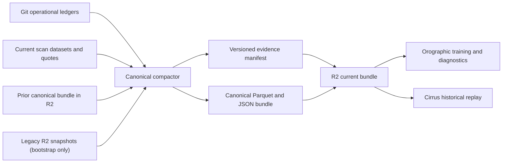

# Orographic evidence lifecycle and consolidation

Status: implementation decision, August 15, 2026

## Decision

Orographic will stop treating each scan, Git ledger, local `output/` directory,
and GitHub Actions artifact as an independent evidence source. They are inputs to
one canonical evidence bundle.

The canonical bundle is append-only at the fact level and replaceable only as a
derived materialization. It contains:

- an immutable merged primary recommendation ledger;
- an immutable merged Moonshot ledger, kept as its own experimental lane;
- deduplicated strict executable option outcomes;
- deduplicated option quote observations and paths;
- a versioned manifest containing file hashes, row counts, schema versions, and
  source snapshots;
- separate counts for cumulative evidence, training-eligible evidence, and the
  current model's prospective evaluation cohort.

R2 is the durable system of record for archived snapshots and the latest
canonical bundle. Git keeps bounded operational ledgers and small diagnostics.
Cirrus consumes the canonical bundle rather than relying on an incidental local
copy of Orographic's archive.

## What happened to the existing data

The data was generally stored, but it was fragmented and often not consumed:

- The primary Git ledger contains 1,666 recommendations across 186 runs. Of
  these, 1,648 were collected under legacy capture policies and 18 under strict
  capture-policy v2.
- The Moonshot ledger contains 437 candidates across 144 runs.
- The two ledgers contain 1,421 picks with at least one fixed-window mark.
- The separately generated strict executable dataset contains 740 rows.
- Each production scan uploads raw option chains and research datasets to a new
  timestamped R2 prefix. The latest inspected scan contained 36,635 option-chain
  rows across 60 symbols.
- GitHub Actions also retains a per-run research artifact for 90 days.
- `output/` is ignored by Git, so local copies can be stale or absent.
- Cirrus reads Orographic's local partitioned archive; it did not restore the R2
  snapshots.

Before this decision, the uploader had no manifest, catalog, restore, or
compaction counterpart. Uploading succeeded, but the next training or replay job
did not automatically see the accumulated history.

## Why readiness appeared to reset

Four different populations were shown as if they were one metric:

1. **Cumulative inventory**: every captured recommendation and quote fact.
2. **Training-eligible evidence**: rows satisfying the selected label contract.
3. **Current-model cohort**: prospective rows scored by one exact model or
   declared evaluation version.
4. **Readiness state**: a derived counter calculated from those facts.

Changing the label contract correctly excludes incompatible legacy rows from a
strict training cohort. Changing a model artifact correctly begins a new
prospective evaluation cohort. Neither event means the underlying history was
deleted. Orographic must report all three evidence populations separately.

## Confirmed failure modes

### Successful captures could be downgraded by retries

The outcome marker wrote `quote_missing_retryable` or `stale_quote_retryable`
before checking whether the window already had an executable label. Ten primary
ledger rows currently contain a Friday label paired with a contradictory retry
status. Seven are in the current payoff cohort. The immutable label survived,
but the readiness diagnostic regressed from seven valid windows to zero.

Captured facts and successful terminal states are now monotonic. A later retry
may append an attempt, but it may not replace a successful mark or label.

### Scheduled capture was not equivalent to the requested cron cadence

From August 11 through August 14, the outcome workflow recorded 47 runs: 44
scheduled and three manual. The nominal quarter-hour schedule would have
requested 160 triggers. Three runs failed. Two confirmed failures created local
capture commits that were rejected as non-fast-forward pushes and then lost with
the ephemeral runner.

The workflow therefore synchronizes the latest branch state before capture and
retries fetch/rebase/push after concurrent writers.

### New evidence collectors were not deployed

Matched Scout-pair capture and dense contract trajectory capture existed only on
the development branch. Production `main` could not accumulate these evidence
types, so their readiness counters stayed at zero regardless of how long the
system ran.

## Canonical evidence contract

Every canonical bundle has an `evidence_manifest.json` with:

- `schema_version` and `bundle_id`;
- generation time and source snapshot identifiers;
- relative file names, SHA-256 hashes, byte sizes, and row counts;
- deduplication keys used for each dataset;
- counts for cumulative inventory, training eligibility, and current cohort;
- validation checks and any skipped or unreadable inputs.

Recommendation identity is based on the emitting run plus stable contract and
lane fields. Quote identity is based on contract plus the observed snapshot
timestamp. Outcome labels are keyed by recommendation and exit window. When two
copies conflict, a valid executable label, fixed mark, or successful capture
state wins over a missing or retryable value. Newer non-terminal metadata may be
retained only when it does not downgrade an immutable fact.

## R2 layout

```text
orographic/
  research-data/
    YYYY/MM/DD/HHMMSS/
      manifest.json
      ...raw snapshot files...
    catalog.json
  evidence-canonical/
    current/
      evidence_manifest.json
      prospective_pick_ledger.json
      moonshot_prospective_ledger.json
      recommendation_outcomes.parquet
      live_option_quotes.parquet
```

The archive catalog is append-only metadata for timestamped scan snapshots. The
`evidence-canonical/current` prefix is a materialized view: data files are
uploaded first and its manifest last, so readers never discover a manifest that
references partially uploaded data.

For R2 history created before manifests existed, the bootstrap restore lists
objects through Cloudflare's R2 Objects API, groups the legacy timestamped
prefixes, and feeds them through the same compactor. Once a canonical bundle has
been published, routine scans restore only that bundle and merge the current
scan's facts.

## Workflow



Each production scan performs the following sequence:

1. Restore the prior canonical bundle from R2. If none exists, optionally
   bootstrap the legacy timestamped archive.
2. Run the scan and build the current research datasets.
3. Merge current facts with the restored canonical bundle.
4. Validate hashes, uniqueness, row counts, and monotonic evidence counts.
5. Upload the timestamped raw snapshot with its manifest and catalog entry.
6. Upload the canonical data files and publish its manifest last.
7. Publish the three evidence populations in scan health and model governance.

## Operational rules

- Do not add a new evidence collector without declaring its immutable identity,
  schema version, retention policy, and canonical compaction rule.
- Do not use mutable retry status as the source of truth when a valid label or
  mark exists.
- Do not train directly from an arbitrary timestamped R2 prefix or a developer's
  local `output/` directory.
- Do not pool incompatible label contracts silently. Preserve every fact and
  select compatible training rows through a versioned derived view.
- Do not pool Moonshot into the primary production lane. Its evidence is
  consolidated and tracked, but remains an explicitly separate experiment.
- Do not describe a current-model cohort count as the total evidence inventory.

## Completion criteria

Evidence consolidation is complete when:

- capture success cannot be downgraded by a later retry;
- every new R2 snapshot has a verifiable manifest and appears in the archive
  catalog;
- a clean runner can restore the current canonical bundle;
- the compactor produces deterministic, duplicate-free ledgers and Parquet
  datasets from current plus restored sources;
- the canonical bundle is published back to R2 with its manifest last;
- Orographic health artifacts expose cumulative, training-eligible, and
  current-model cohort counts separately;
- Cirrus can resolve and consume the canonical bundle through its Orographic
  archive adapter;
- regression tests cover conflicting retry state, duplicate snapshots,
  corrupted files, and restore/upload ordering.
