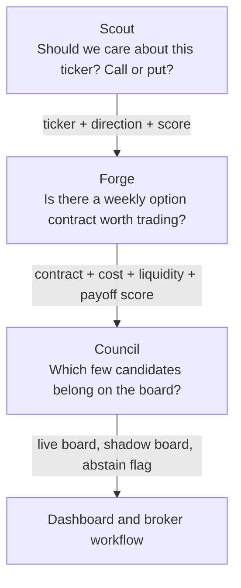
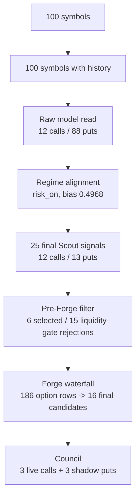

# Orographic Technical Analysis Report Card

Date: 2026-04-16

## Executive Read

Orographic is now a functioning short-horizon options research and scan workflow, not just a signal toy. The live path runs end to end: Scout generates directional ideas, Forge converts selected ideas into weekly option candidates, and Council selects a live board. The April 16 live snapshot produced `25` Scout signals, selected `6` for Forge, generated `16` Forge candidates, and ended with a `3` contract live board.

The main issue is not that the engine cannot find trades anymore. The main issue is that the workflow is still too dependent on macro regime gating and modeled-chain validation. Scout's raw read on April 16 was mostly bearish (`88` pre-veto puts vs `12` calls), but the `risk_on` regime filter reduced that to `13` puts and `12` calls, then Forge and Council ultimately produced an all-call live board. That is a meaningful trading behavior: the system is expressing broad-tape bullish mean reversion even while many single-name raw model scores are bearish.

Bottom line: the workflow has improved from "abstains too often" to "trades, but with fragile validation and one-sided live expression." I would keep the architecture, but I would not increase live capital until options-data coverage, payoff-aware labels, and side/regime diagnostics are stronger.

## Simple Definitions

| Layer | Plain-English job | Trading-desk analogy | Current state |
| --- | --- | --- | --- |
| Scout | Finds which tickers have a short-term directional edge and whether that edge points to calls or puts. | The technical analyst and tape reader. | Good feature set, but it predicts positive 5-day stock return rather than option payoff. |
| Forge | Looks at the option chain and asks whether the idea can be expressed with a tradable weekly contract. | The options structurer checking premium, spread, delta, IV, liquidity, and breakeven. | Much better than before; now converts selected live signals, but still uses single-leg structures and heuristic projected moves. |
| Council | Chooses the final live board and shadow board from Forge candidates. | The portfolio manager/risk gate. | Useful diversification wrapper, but the Markowitz/Kelly story is stronger than the actual implementation. |

## Current Workflow Diagram


## Scout, Forge, Council In Simple Terms



## Report Card

| Area | Grade | Assessment |
| --- | --- | --- |
| Architecture | A- | The Scout -> Forge -> Council separation is clean, inspectable, and easy to improve without rewriting the whole system. |
| Technical-analysis feature set | B+ | Momentum, RSI, realized vol, ATR, volume, mean-reversion distance, SPY momentum, SPY vol, and relative strength are all sensible weekly-options inputs. |
| Directional ML model | B- | LightGBM is a real upgrade and the top features make market sense, but the label is only `fwd_5d_return > 0`, not option payoff or move-over-breakeven. |
| Regime handling | B- | The soft counter-regime policy is better than the old hard veto, but regime still dominates live expression and can delay side transitions. |
| Contract selection | B- | Forge now has a good filter waterfall and real candidate conversion. It still relies on heuristic projected move, single-leg longs, and no learned contract-success model. |
| Portfolio selection | C+ | Council de-duplicates symbols, checks concentration, and can use correlations, but expected returns and covariance are approximate. Kelly sizing is defined but not connected to live sizing. |
| Backtest integrity | C | Sizing is cleaner than the older report found, but April 15 modeled-chain results still have `0%` real options-chain coverage. Strict-real testing produced no trades because local OptionsDX coverage is too sparse. |
| Live readiness | C+ | The April 16 scan produces a live board, which is a big operational improvement. The live book is still all calls and heavily regime-shaped. |
| Observability | B | The Forge rejection waterfall is excellent progress. Next missing piece is time-series monitoring of side mix, regime vetoes, calibration, and realized live-board outcomes. |
| Overall | B- | A credible research platform with a working daily scan, but not yet an institutional-grade trading process. |

## Evidence From The Latest Live Snapshot

Source: `web/data/latest_run.json`, generated `2026-04-16T18:29:17+00:00`.

| Metric | Value |
| --- | ---: |
| Universe size | 100 |
| Regime | `risk_on` |
| Regime bias | `0.4968` |
| Scout signals | 25 |
| Pre-veto Scout side mix | 12 calls / 88 puts |
| Final Scout side mix | 12 calls / 13 puts |
| Counter-regime survivors | 13 |
| Pre-Forge selected symbols | PG, MCD, KO, VZ, WFC, PYPL |
| Forge candidates | 16 |
| Live board | VZ call, WFC call, PYPL call |
| Shadow board | KO put, MCD put, PG put |

This tells us the model's raw technical read was defensive or bearish across much of the universe, but the regime gate let only high-conviction counter-regime bearish names survive. Forge did create put candidates, but they scored too low for the live board.

## Current Live Funnel



## Forge Waterfall, April 16

| Stage | Count |
| --- | ---: |
| Signals considered | 6 |
| Signals with expiry | 6 |
| Signals with chain | 6 |
| Rows after basic cleanup | 186 |
| Rows with positive bid/ask | 153 |
| Rows within long-leg cap | 66 |
| Rows within spread cap | 28 |
| Rows passing liquidity | 24 |
| Rows passing moneyness | 18 |
| Rows passing delta | 16 |
| Rows passing net debit | 16 |
| Final candidates | 16 |

This is a healthy operational improvement versus the April 8 report, where the system generated Scout signals but failed to convert them into Forge candidates. The present bottleneck is more subtle: final live expression is call-heavy because call candidates score better under risk-on conditions.

## Model Review

Scout trains a LightGBM classifier on daily OHLCV-derived technical features. Its target is a binary 5-day forward stock-return label:

```text
label = 1 if forward 5-day stock return is positive
label = 0 otherwise
```

That makes Scout a bull-probability model. Puts are created by mapping low bull probability into a negative score. This is acceptable for a first generation, but it is not the same as directly modeling put profitability.

The current model artifact has `18` features. Top importances:

| Rank | Feature | Importance |
| ---: | --- | ---: |
| 1 | `spy_rv20` | 1628 |
| 2 | `spy_mom_5d` | 1491 |
| 3 | `spy_mom_20d` | 1469 |
| 4 | `vol_regime` | 804 |
| 5 | `rv60` | 764 |
| 6 | `mom_60d` | 732 |
| 7 | `atr_pct_14d` | 713 |
| 8 | `rv20` | 615 |
| 9 | `mom_10d` | 553 |
| 10 | `rsi_7` | 541 |

Interpretation: the model is macro/tape heavy. The top three features are SPY context, not single-name chart structure. That is why regime and broad-market behavior can dominate side selection.

## Technical-Analysis Read

The system currently behaves like this:

1. It reads broad market tape first.
2. It lets single-name oversold/overbought structure influence the score.
3. It applies a regime tailwind or penalty.
4. It only buys weekly options when premium, spread, liquidity, delta, and breakeven look acceptable.

That is a coherent short-horizon options approach. The technical-analysis edge is most likely coming from a mix of:

- broad-market trend and volatility state
- single-name mean reversion after short-term dislocation
- avoiding illiquid or overpriced weekly contracts
- not forcing trades when no contract passes filters

The weak spot is that Scout's target is not the thing the strategy actually monetizes. Weekly options need magnitude and timing, not just direction.

## Performance Review

### Live scan performance

The April 16 scan is operationally healthy:

- `25%` of the universe became final Scout signals.
- `6` signals were sent to Forge.
- all `6` Forge symbols produced at least one final contract candidate.
- Council selected `3` live contracts and did not abstain.

The concern is side expression:

- raw model: mostly puts
- final Scout: balanced
- Forge candidates shown in dashboard: all calls
- live board: all calls
- shadow board: all puts

That is not inherently wrong in a risk-on tape, but it should be monitored. If the market turns, we need proof the workflow rotates quickly enough.

### Modeled backtest performance

April 15 soft-regime 3-month modeled-chain run:

| Metric | Value |
| --- | ---: |
| Backtest window | 2026-01-15 to 2026-04-15 |
| Trades | 821 |
| Win rate | 51.16% |
| Total P&L | $79,854.21 |
| Net return | 51.39% |
| Sharpe | 4.8210 |
| Max drawdown | -81.32% |
| Calls | 385 |
| Puts | 436 |
| Expired worthless | 296 |
| Real options-chain coverage | 0.0% |

This is useful for signal behavior, not execution proof. All `821` entries and exits came from synthetic chains. The strict-real six-month SPY attempt produced `0` trades because local OptionsDX coverage is insufficient, which is a data-quality finding rather than an alpha result.

### Walk-forward deployable variant

`web/data/walk_forward_results.json` shows the selected deployable variant:

| Metric | Value |
| --- | ---: |
| Variant | Council + Cost Cap + Symbol Priors |
| Window | 2025-10-09 to 2026-04-07 |
| Symbols | 45 |
| Trades | 27 |
| Win rate | 55.56% |
| Total P&L | $1,983.17 |
| Net return | 21.79% |
| Sharpe | 2.0706 |
| Max drawdown | -39.30% |
| Calls / puts | 21 / 6 |
| Max observed cost basis | $498.01 |

This is a more believable result than the all-candidate modeled run because it is smaller, cost-capped, and closer to deployable selection. It still needs real-chain replay before it can carry live-capital confidence.

## Main Risks

### 1. Scout predicts direction, not option payoff

A positive 5-day stock return is not enough for weekly calls. The move must beat premium, spread, and theta. A negative bull probability is also not the same as a calibrated put edge.

### 2. Regime can overpower single-name signal

The April 16 raw model read was `88` puts and `12` calls, but the final live board was `3` calls. That may be correct if the system is intentionally buying risk-on rebounds, but it needs explicit measurement.

### 3. Real options data is the biggest validation gap

The modeled-chain results look strong, but current real-chain coverage is too sparse to validate six-month execution quality. This is the largest blocker to institutional confidence.

### 4. Council is not yet a full portfolio optimizer

Council uses live correlations and implied vol proxies, but its expected returns are transformed Scout scores. It is useful, but not yet a robust optimizer. The code also defines Kelly sizing separately from the actual backtest sizing path.

### 5. Single-leg weekly structures are fragile

Single-leg weekly options are sensitive to bid/ask, theta, and volatility crush. Forge scores these costs, but the engine would be stronger if it compared single legs against vertical debit spreads and chose the better expression.

## Improvement Plan

### Phase 1: Make validation honest

1. Expand OptionsDX coverage enough to run strict-real replay across at least 3 to 6 months.
2. Make every report split results into:
   - real-chain trades
   - synthetic-chain trades
   - hybrid/missing exits
3. Promote strict-real coverage failure to the top of dashboards and docs.
4. Store model hash, feature list, parameters, universe, and chain-source summary in every backtest artifact.

Success test: a strict-real backtest produces enough trades to estimate win rate, average P&L, slippage, and expiration risk without synthetic fallback.

### Phase 2: Train the model on tradable outcomes

Add second-stage labels built from replayed option outcomes:

| Target | Why it matters |
| --- | --- |
| `prob_positive_option_pnl` | Directly estimates whether the selected option makes money. |
| `expected_option_return_pct` | Ranks magnitude, not just direction. |
| `prob_exceeds_breakeven` | Forces the model to care about premium and strike. |
| `max_favorable_excursion_before_expiry` | Helps time weekly options before theta dominates. |
| `adverse_excursion_risk` | Helps avoid names that shake out before the move arrives. |

Recommended scoring blend:

```text
final_candidate_score =
  0.25 * directional_edge
+ 0.35 * prob_positive_option_pnl
+ 0.20 * expected_option_return_pct_rank
+ 0.10 * liquidity_score
+ 0.10 * regime_alignment
```

### Phase 3: Split bull and bear behavior

Instead of treating puts as "not bullish," train either:

- separate call and put payoff models, or
- one three-class model: `call_edge`, `put_edge`, `no_trade`.

This would help during transitions where broad market is still risk-on but many single names are technically exhausted.

### Phase 4: Improve technical-analysis timing

Add features that directly answer entry/exit timing questions:

| Feature family | Examples | Purpose |
| --- | --- | --- |
| Trend quality | ADX, moving-average slope, higher-high/lower-low counts | Separate trend continuation from noisy chop. |
| Mean reversion | Bollinger z-score, distance from VWAP/MA in ATR units, RSI divergence | Improve rebound and fade entries. |
| Volume confirmation | volume z-score, dollar volume, accumulation/distribution | Avoid illiquid false moves. |
| Volatility compression | realized-vol percentile, ATR squeeze, range compression | Find setups before expansion. |
| Market internals | sector ETF relative strength, beta-adjusted residual momentum | Stop SPY from explaining everything. |
| Event risk | earnings proximity, FOMC/CPI week, ex-dividend | Avoid unmodeled jumps and IV crush. |

### Phase 5: Upgrade Forge from filter to structurer

1. Compare long option vs vertical debit spread for every signal.
2. Rank by expected payoff after estimated bid/ask and theta, not only projected intrinsic value.
3. Add a maximum acceptable theta burn per day.
4. Add IV percentile and IV/RV spread by symbol with historical parity.
5. Track rejected contracts by reason over time, not only per scan.

### Phase 6: Make Council a real risk engine

1. Use realized option P&L distributions by symbol/side/regime as expected returns.
2. Size by drawdown contribution, not only candidate score.
3. Enforce sector and factor concentration limits.
4. Convert the Kelly helper into an auditable sizing policy or remove it to avoid false confidence.
5. Add kill-switch rules for:
   - high realized drawdown
   - repeated same-symbol losses
   - regime transition weeks
   - excessive same-side live-board concentration

## Priority Scorecard

| Priority | Work item | Impact | Effort |
| ---: | --- | --- | --- |
| 1 | Expand strict real-chain coverage and fail reports closed when coverage is low. | Very high | Medium/high |
| 2 | Add option-payoff labels and a second-stage contract-success model. | Very high | High |
| 3 | Add side/regime calibration reports by day and week. | High | Medium |
| 4 | Compare single-leg and debit-spread expressions in Forge. | High | Medium |
| 5 | Add call/put separate performance and transition-lag monitoring. | High | Low/medium |
| 6 | Refactor Council sizing into one documented policy. | Medium/high | Medium |
| 7 | Add event/calendar features with historical parity. | Medium | Medium |

## Practical Trading Interpretation

In simple terms, Orographic is currently best described as:

> A broad-market-aware technical model that finds short-term stock direction, filters for tradable weekly options, and chooses a small board of contracts.

What it is not yet:

> A fully validated options-alpha engine that knows, with calibrated confidence, which option structure has positive expected value after premium, spread, theta, IV, and regime risk.

## Final Grade

Overall grade: `B-`

The architecture deserves a better grade than the validation. The model and workflow are good enough to keep improving aggressively. They are not yet good enough to trust headline modeled Sharpe as live trading evidence. The next leap is not another clever rule. It is payoff-aware training plus real-chain validation.

