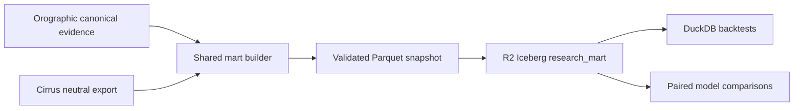

# Cirrus + Orographic shared research mart

Status: local pilot implemented; R2 Iceberg catalog enabled; production publication is token-gated.

## Decision

Orographic's canonical evidence bundle remains the durable market-data source. Cirrus contributes
its neutral research export. The shared mart conforms both systems into stable analytical tables
without replacing either application's operational ledger.

Operational SQLite/JSON state is never queried directly by a backtest after a mart snapshot has
been selected. A backtest records the `mart_id`, source bundle IDs, model versions, and exit-policy
identifier used for the run.

## Architecture



The existing hashed Parquet bundles remain the recovery and migration path. Iceberg is an
analytical publication target, not the only copy of the evidence.

## Conformed tables

| Table | Grain | Primary key |
| --- | --- | --- |
| `model_runs` | One system/cohort execution | `run_key` |
| `recommendations` | One model recommendation or shadow candidate | `recommendation_key` |
| `execution_outcomes` | One recommendation under one frozen exit policy | `outcome_key` |
| `option_quotes` | One source quote observation | `quote_key` |
| `feature_snapshots` | One point-in-time feature schema per recommendation | `feature_key` |
| `path_exclusions` | One exclusion reason per recommendation | `exclusion_key` |

Every table retains `source_system` or an explicit parent carrying it, and all model-facing facts
retain source bundle identity. Orographic primary and Moonshot cohorts remain separate. Cirrus
research, live, shadow, and board lanes remain distinguishable through `lane`.

## Point-in-time and execution rules

- Recommendation evidence cannot be available before its decision timestamp.
- Feature snapshots cannot be available after the decision timestamp.
- Outcome labels cannot be available before the decision timestamp.
- Quote availability cannot precede quote observation.
- Cirrus outcomes are executable only when they are not excluded, have at least two observations,
  include a live-chain mark, and have a completed exit reason rather than `latest_mark`.
- Orographic executable outcomes require entry and exit prices plus an executable label contract.
- Historical, primary prospective, Moonshot, and Cirrus prospective cohorts are never silently
  pooled. Backtests must choose cohorts explicitly.

## Build locally

First produce a current Cirrus neutral export:

```bash
cd /path/to/Cirrus
PYTHONPATH=src .venv/bin/python scripts/export_options_research_bundle.py \
  --db state/cirrus_performance.db \
  --output-dir analysis/output/options_research_bundle
```

Then build the shared mart from Orographic:

```bash
cd /path/to/Orographic
./.venv/bin/python scripts/build_shared_research_mart.py \
  --orographic-canonical-dir output/canonical_evidence \
  --cirrus-export-dir ../Cirrus/analysis/output/options_research_bundle \
  --output-dir output/shared_research_mart
```

The builder validates both source manifests, writes through a staging directory, validates keys,
parents, hashes, row counts, and time ordering, then atomically replaces the prior local mart.

## R2 Iceberg publication

The Data Catalog is enabled on the existing `orographic-research-data` bucket:

- Catalog URI: `https://catalog.cloudflarestorage.com/fb7bb10f51e3f6c0fe572d28a3a7e1f4/orographic-research-data`
- Warehouse: `fb7bb10f51e3f6c0fe572d28a3a7e1f4_orographic-research-data`
- Namespace: `research_mart`

Create a bucket-scoped token with both R2 object and R2 Data Catalog read/write permissions, then
provide it outside Git:

```bash
export OROGRAPHIC_R2_DATA_CATALOG_URI="https://catalog.cloudflarestorage.com/fb7bb10f51e3f6c0fe572d28a3a7e1f4/orographic-research-data"
export OROGRAPHIC_R2_DATA_CATALOG_WAREHOUSE="fb7bb10f51e3f6c0fe572d28a3a7e1f4_orographic-research-data"
export OROGRAPHIC_R2_DATA_CATALOG_TOKEN="..."
```

Inspect the publication plan without network writes:

```bash
./.venv/bin/python scripts/publish_shared_research_mart.py \
  --mart-dir output/shared_research_mart
```

Install the optional publisher dependency and publish only after reviewing the plan:

```bash
./.venv/bin/pip install -r engine/requirements-mart.txt
./.venv/bin/python scripts/publish_shared_research_mart.py \
  --mart-dir output/shared_research_mart \
  --apply
```

Publication refuses an Orographic-only or Cirrus-only mart. It merges all six data tables and
commits `mart_publications` last so a consumer can distinguish a completed publication from an
interrupted one.

## Production rollout gates

1. Persist the current Cirrus neutral export to durable storage after marks and settlement.
2. Restore both source bundles in the Orographic scan workflow.
3. Build and validate the two-source mart in CI.
4. Compare Parquet and Iceberg row counts, keys, and returns for at least three weekly cycles.
5. Point backtests at a recorded Iceberg publication only after parity remains clean.
6. Retain the existing canonical Parquet manifests until Iceberg restore and time-travel drills pass.

No production selector, model, trade gate, or execution setting is changed by the mart.
