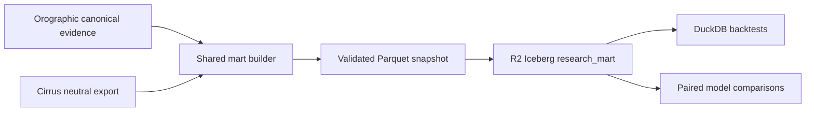

# Cirrus + Orographic shared research mart

Status: production pilot published and independently row-count verified on 2026-08-24.

## Decision

Orographic's canonical evidence bundle remains the durable market-data source. Cirrus contributes
its neutral research export. The shared mart conforms both systems into stable analytical tables
without replacing either application's operational ledger.

Operational SQLite/JSON state is never queried directly by a backtest after a mart snapshot has
been selected. A backtest records the `mart_id`, source bundle IDs, model versions, and exit-policy
identifier used for the run.

## Architecture



The existing hashed Parquet bundles remain the recovery and migration path. Iceberg is an
analytical publication target, not the only copy of the evidence.

## Conformed tables

| Table | Grain | Primary key |
| --- | --- | --- |
| `model_runs` | One system/cohort execution | `run_key` |
| `recommendations` | One model recommendation or shadow candidate | `recommendation_key` |
| `execution_outcomes` | One recommendation under one frozen exit policy | `outcome_key` |
| `option_quotes` | One source quote observation | `quote_key` |
| `feature_snapshots` | One point-in-time feature schema per recommendation | `feature_key` |
| `path_exclusions` | One exclusion reason per recommendation | `exclusion_key` |

Every table retains `source_system` or an explicit parent carrying it, and all model-facing facts
retain source bundle identity. Orographic primary and Moonshot cohorts remain separate. Cirrus
research, live, shadow, and board lanes remain distinguishable through `lane`.

Both systems now populate `feature_snapshots`. Cirrus contributes its candidate feature snapshots;
Orographic contributes one `orographic_pick_features_v1` snapshot per pick, built from decision-time
scores, risk features, entry-quote fields, and regime context. Post-decision `outcomes` fields are
never captured as features, and every Orographic feature snapshot is anchored to the recommendation
decision timestamp so `available_at_utc <= decision_at_utc` always holds. This is what makes the
`orographic_training_v1` consumer view non-empty and unblocks the training-source rebuild gate.

## Point-in-time and execution rules

- Recommendation evidence cannot be available before its decision timestamp.
- Feature snapshots cannot be available after the decision timestamp.
- Outcome labels cannot be available before the decision timestamp.
- Quote availability cannot precede quote observation.
- Cirrus outcomes are executable only when they are not excluded, have at least two observations,
  include a live-chain mark, and have a completed exit reason rather than `latest_mark`.
- Orographic executable outcomes require entry and exit prices plus an executable label contract.
- Historical, primary prospective, Moonshot, and Cirrus prospective cohorts are never silently
  pooled. Backtests must choose cohorts explicitly.

## Build locally

First produce a current Cirrus neutral export:

```bash
cd /path/to/Cirrus
PYTHONPATH=src .venv/bin/python scripts/export_options_research_bundle.py \
  --db state/cirrus_performance.db \
  --output-dir analysis/output/options_research_bundle
```

Then build the shared mart from Orographic:

```bash
cd /path/to/Orographic
./.venv/bin/python scripts/build_shared_research_mart.py \
  --orographic-canonical-dir output/canonical_evidence \
  --cirrus-export-dir ../Cirrus/analysis/output/options_research_bundle \
  --output-dir output/shared_research_mart
```

The builder validates both source manifests, writes through a staging directory, validates keys,
parents, hashes, row counts, and time ordering, then atomically replaces the prior local mart.

## R2 Iceberg publication

The Data Catalog is enabled on the existing `orographic-research-data` bucket:

- Catalog URI: `https://catalog.cloudflarestorage.com/fb7bb10f51e3f6c0fe572d28a3a7e1f4/orographic-research-data`
- Warehouse: `fb7bb10f51e3f6c0fe572d28a3a7e1f4_orographic-research-data`
- Namespace: `research_mart`

Create an **R2 Account API Token** with Cloudflare's **Admin Read & Write** R2 permission. That
permission includes both object access and Data Catalog table/metadata access. Cloudflare's current
dashboard applies this permission at the account's R2 scope rather than to one bucket, so store it
only as the encrypted `CLOUDFLARE_R2_API_TOKEN` repository secret and provide it outside Git:

```bash
export OROGRAPHIC_R2_DATA_CATALOG_URI="https://catalog.cloudflarestorage.com/fb7bb10f51e3f6c0fe572d28a3a7e1f4/orographic-research-data"
export OROGRAPHIC_R2_DATA_CATALOG_WAREHOUSE="fb7bb10f51e3f6c0fe572d28a3a7e1f4_orographic-research-data"
export OROGRAPHIC_R2_DATA_CATALOG_TOKEN="..."
```

Inspect the publication plan without network writes:

```bash
./.venv/bin/python scripts/publish_shared_research_mart.py \
  --mart-dir output/shared_research_mart
```

Install the optional publisher dependency and publish only after reviewing the plan:

```bash
./.venv/bin/pip install -r engine/requirements-mart.txt
./.venv/bin/python scripts/publish_shared_research_mart.py \
  --mart-dir output/shared_research_mart \
  --apply
```

Publication refuses an Orographic-only or Cirrus-only mart. It merges all six data tables and
commits `mart_publications` last so a consumer can distinguish a completed publication from an
interrupted one.

### Initial production publication

Mart `bfc84a047c5c0e947c02a75de885e8bba2c513b6aa07af8f62976e4672979b64` was published to
`research_mart` and verified against its manifest:

- 395 model runs
- 2,596 recommendations
- 1,246 execution outcomes
- 836,413 option quotes
- 103 feature snapshots
- 4 path exclusions
- 1 final `mart_publications` record

## Production rollout gates

1. Persist the current Cirrus neutral export to durable storage after marks and settlement.
2. Restore both source bundles in the Orographic scan workflow.
3. Build and validate the two-source mart in CI.
4. Compare Parquet and Iceberg row counts, keys, and returns for at least three weekly cycles.
5. Point backtests at a recorded Iceberg publication only after parity remains clean.
6. Retain the existing canonical Parquet manifests until Iceberg restore and time-travel drills pass.

No production selector, model, trade gate, or execution setting is changed by the mart.

## Scan-workflow sync

The scheduled Orographic scan keeps the mart aligned with this repo:

1. Restore Orographic canonical evidence and, when present, the Cirrus export from
   `r2://$OROGRAPHIC_RESEARCH_R2_BUCKET/cirrus/options_research_bundle/current`.
2. Run `scripts/sync_shared_research_mart.py --allow-missing`. A missing Cirrus export is a
   diagnostic, not a live-scan failure. A two-source mart is required before consumers, Iceberg
   publication, or rebuild-readiness promotion.
3. Persist `web/data/diagnostics/shared_mart_sync_latest.json` and refresh
   `shared_mart_shadow_evidence_latest.json` plus `weekly_alpha_review_latest.json`.
4. Orographic feature snapshots now come from recommendation-time scores, risk features, and
   entry quotes (`orographic_recommendation_features_v1`) so `orographic_training_v1` is no longer
   an empty join.

Publish a current Cirrus `options_research_bundle` to that R2 prefix after Cirrus marks and
settlement. The mart still refuses a one-system publication.

## Orographic consumer rollout

Orographic materializes seven versioned views from one validated local mart snapshot:

| View | Purpose | Initial authority |
| --- | --- | --- |
| `orographic_training_v1` | Point-in-time Orographic features joined to executable labels | Observation only |
| `orographic_execution_quality_v1` | Spread, liquidity, quote, feature, and outcome coverage | Research; later shadow veto |
| `orographic_exit_replay_v1` | Executable ask-to-bid quote paths for frozen exit-policy replay | Shadow only |
| `cirrus_orographic_disagreement_v1` | One top daily recommendation per system and symbol | Research only |
| `orographic_model_monitoring_v1` | Source/cohort/model/side monitoring aggregates | Diagnostics only |
| `mart_data_quality_v1` | Per source/cohort null rates, spread anomalies, crossed quotes, and coverage | Diagnostics only |
| `orographic_training_funnel_v1` | Per source/cohort training-row yield and stage-by-stage drop-off | Diagnostics only |

### Data-quality scorecard (`mart_data_quality_v1`)

One row per `(source_system, cohort)` measuring whether the mart is trustworthy enough to train and
compare on. It surfaces, without any routing authority:

- Coverage: `feature_coverage_rate`, `path_quote_coverage_rate`, `executable_outcome_coverage_rate`.
- Decision-field null rates: `entry_mid_null_rate`, `score_null_rate`, `strike_null_rate`,
  `expiry_null_rate`, `contract_symbol_null_rate`, `underlying_null_rate`, rolled into `critical_null_rate`.
- Quote integrity: `crossed_entry_rate`, `nonpositive_entry_mid_rate`, `path_crossed_quote_rate`,
  `path_null_iv_rate`, `path_null_delta_rate`, plus entry-spread stats
  (`avg_entry_spread_pct`, `median_entry_spread_pct`, `wide_entry_spread_rate`), rolled into
  `integrity_anomaly_rate`.

`scripts/build_shared_mart_shadow_evidence.py` folds this into a `data_quality` block (worst null and
integrity rates, minimum coverage, and how many cohorts show gaps) so regressions in incoming data are
visible before they silently degrade training or paired comparisons.

### Training-readiness funnel (`orographic_training_funnel_v1`)

One row per `(source_system, cohort)` answering the operative question — *can this mart actually be
used to train and improve the models?* It reproduces the exact join semantics of
`orographic_training_v1` (a point-in-time feature with `available_at_utc <= decision_at_utc`, an
executable non-excluded outcome, and a label available at or after the decision) and reports the yield
and where recommendations are lost:

- Funnel counts: `recommendations`, `with_any_feature`, `with_point_in_time_feature`,
  `with_executable_outcome`, `with_valid_label_outcome`, `training_eligible_recommendations`, and
  `training_rows` (matches the `orographic_training_v1` row count for Orographic cohorts).
- Mutually exclusive drop-off reasons, attributed in funnel order: `dropped_missing_feature`,
  `dropped_feature_not_point_in_time`, `dropped_missing_executable_outcome`, and
  `dropped_label_before_decision`.
- Rates: `point_in_time_feature_coverage_rate`, `valid_label_coverage_rate`, and
  `training_eligibility_rate`.

The shadow evidence rollup folds this into a `training_funnel` block (including a `training_mart_usable`
flag that is true once any training-eligible rows exist), so a structurally empty training set — the
failure mode the point-in-time Orographic feature snapshots were added to fix — is visible directly in
the committed diagnostics rather than only as a blocked rebuild gate.

Build them with `scripts/build_shared_mart_consumers.py`. The generated consumer manifest pins the
source `mart_id`, requires both systems, hashes every output, and grants no scoring, Council, sizing,
or order-routing authority. `scripts/build_rebuild_readiness.py` treats this bundle as a required
fail-closed gate before a fold-frozen challenger can become eligible for promotion review.

`scripts/build_shared_mart_shadow_evidence.py` turns these views into one compact diagnostic.
It requires 30 paired executable cross-system outcomes and 30 independent paired market dates
before recommending that a single liquidity veto enter shadow evaluation. Passing those entry gates
still grants no production authority; production promotion remains governed by the stricter rebuild
readiness and paired-day comparison gates.
