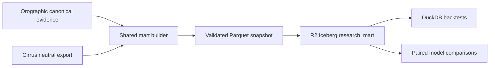

# Cirrus + Orographic shared research mart

Status: production pilot published and independently row-count verified on 2026-08-24.

## Decision

Orographic's canonical evidence bundle remains the durable market-data source. Cirrus contributes
its neutral research export. The shared mart conforms both systems into stable analytical tables
without replacing either application's operational ledger.

Operational SQLite/JSON state is never queried directly by a backtest after a mart snapshot has
been selected. A backtest records the `mart_id`, source bundle IDs, model versions, and exit-policy
identifier used for the run.

## Architecture



The existing hashed Parquet bundles remain the recovery and migration path. Iceberg is an
analytical publication target, not the only copy of the evidence.

The production scan workflow restores a Cirrus export from
`r2://$OROGRAPHIC_RESEARCH_R2_BUCKET/cirrus/options_research_bundle/current` when present,
falls back to the newest valid dated prefix under `cirrus/`, `orographic/cirrus/`, or
`options_research_bundle/` if `current` is empty,
rebuilds the two-source mart, and writes `shared_mart_sync_latest.json`. A fallback
rebuild is pinned as `cirrus_pin=fallback` and is not weekly alpha versus Cirrus.
After Cirrus is published, `Sync shared research mart` can be dispatched without waiting
for the next live scan. Merging mart-sync changes onto `main` also runs that workflow so
the two-source rebuild does not wait for the next Tradier scan.
Publish a current bundle with:

```bash
python scripts/upload_research_artifacts_to_r2.py --mode cirrus \
  ../Cirrus/analysis/output/options_research_bundle
```

If `output/canonical_evidence` is not on disk yet, the sync also accepts
`output/restored_canonical_evidence` so a restore-only runner still rebuilds the mart.
When no Cirrus export exists but `shared-research-mart/staging/*.tar.gz` does, the sync
restores that dated two-source archive, then rebuilds with current Orographic canonical
evidence while keeping the archived Cirrus rows. That refresh is still
`cirrus_pin=fallback` and is not weekly alpha versus Cirrus; it only fills
`orographic_training_v1` with post-August point-in-time Orographic features.
Missing Cirrus data fails closed to that diagnostic and does not block the live scan.
The diagnostic records every `cirrus/` prefix that contains a `manifest.json` so an
empty `current` key is distinguishable from a bundle uploaded to the wrong path.
Research-data audits are persisted to
`web/data/diagnostics/research_data_capture_audit_latest.json` and are warn-only in the
scan job so a Moonshot/dataset mismatch cannot skip mart consolidation.

Cirrus also publishes each validated export to the orphan git branch
`data/options-research-bundle`. Orographic's weekday `Sync shared research mart` job runs after the
Cirrus scan, clones that branch with `OROGRAPHIC_CRON_GITHUB_TOKEN`, validates every Parquet hash and
row count, and atomically materializes it at
`../Cirrus/analysis/output/options_research_bundle`. The dedicated sync then rebuilds the two-source
mart, promotes the current Cirrus bundle to R2, and publishes and verifies the Iceberg tables. A
materialization or validation failure fails the dedicated sync; the live Orographic scan treats the
same step as non-blocking and retains the R2/archive fallback.

## Collection quality audit

[`analysis/shared_mart_data_quality_audit.ipynb`](../analysis/shared_mart_data_quality_audit.ipynb)
profiles the latest validated source bundles and rebuilt shared mart at their actual grains. It checks
freshness, key integrity, point-in-time feature safety, option-side validity, score coverage,
post-entry path coverage, executable-label coverage, and same-date/symbol overlap.

The September 15, 2026 audit found that both sources have complete conformed feature and score
coverage after normalization, but joint evidence is still immature: 10 exploratory paired date/symbol
rows across 8 market dates and only 2 paired executable outcomes. These include research lanes;
there are no same-date/symbol live-versus-live pairs in that snapshot. The v2 conformance now retains position legs
and experiment decisions. New scans can capture path IV/Greeks and Cirrus scan-time code revisions;
Cirrus path outcomes now retain the selected quote's exact exit timestamp. The historical gaps cannot
be reconstructed. The mart stays observation-only while those gaps and the existing
promotion gates remain open.

New Orographic trajectory captures request and retain available option IV, Greeks, open interest,
and volume alongside bid/ask marks. This does not backfill old paths. Tradier's
[quote reference](https://docs.tradier.com/docs/quotes) documents the optional fields; its
[market-data guidance](https://docs.tradier.com/docs/market-data) notes that Greeks are hourly and
unavailable in the sandbox. A missing or stale Greek therefore cannot be treated as a zero or a
fresh decision-time feature. Executable return labels continue to rely on bid/ask, not Greeks.

## Conformed tables

| Table | Grain | Primary key |
| --- | --- | --- |
| `model_runs` | One system/cohort execution | `run_key` |
| `recommendations` | One model recommendation or shadow candidate | `recommendation_key` |
| `execution_outcomes` | One recommendation under one frozen exit policy | `outcome_key` |
| `option_quotes` | One source quote observation | `quote_key` |
| `quote_provenance` | One record per recommendation-linked quote, or unlinked quote with additional provider timing | `quote_key` |
| `feature_snapshots` | One point-in-time feature schema per recommendation | `feature_key` |
| `path_exclusions` | One exclusion reason per recommendation | `exclusion_key` |
| `position_legs` | One observed or inferred contract leg per recommendation | `leg_key` |
| `experiment_tags` | One strategy tag per recommendation | `tag_key` |
| `experiment_scan_decisions` | One strategy decision per run | `decision_key` |

Every table retains `source_system` or an explicit parent carrying it, and all model-facing facts
retain source bundle identity. Orographic primary and Moonshot cohorts remain separate. Cirrus
research, live, shadow, and board lanes remain distinguishable through `lane`.

Both systems now populate `feature_snapshots`. Cirrus contributes its candidate feature snapshots;
Orographic contributes one `orographic_pick_features_v1` snapshot per pick, built from decision-time
scores, risk features, entry-quote fields, and regime context. Post-decision `outcomes` fields are
never captured as features, and every Orographic feature snapshot is anchored to the recommendation
decision timestamp so `available_at_utc <= decision_at_utc` always holds. This is what makes the
`orographic_training_v1` consumer view non-empty and unblocks the training-source rebuild gate.

`option_quotes` carries two Orographic populations:

- **Shared-market chain quotes** from the live options archive (`recommendation_key` is null). These
  remain the durable market-data plane for Cirrus replay and coverage audits.
- **Recommendation-linked path quotes** materialized from each pick's `emission_quote`,
  `outcomes.trajectory_marks`, and `outcomes.archived_quote_path.marks`, with `recommendation_key`
  set. These rows are what `orographic_exit_replay_v1` joins so Orographic exit-policy shadow work
  is no longer Cirrus-only.

## Point-in-time and execution rules

- Recommendation evidence cannot be available before its decision timestamp.
- Feature snapshots cannot be available after the decision timestamp.
- Outcome labels cannot be available before the decision timestamp.
- Quote availability cannot precede quote observation.
- Cirrus outcomes are executable only when they are not excluded, have at least two observations,
  include a live-chain mark, and have a completed exit reason rather than `latest_mark`.
- Orographic executable outcomes require entry and exit prices plus an executable label contract.
- Historical, primary prospective, Moonshot, and Cirrus prospective cohorts are never silently
  pooled. Backtests must choose cohorts explicitly.

## Build locally

First produce a current Cirrus neutral export:

```bash
cd /path/to/Cirrus
PYTHONPATH=src .venv/bin/python scripts/export_options_research_bundle.py \
  --db state/cirrus_performance.db \
  --output-dir analysis/output/options_research_bundle
```

Then publish that bundle to the R2 prefix Orographic scans restore, using the same
Cloudflare R2 token as live scans:

```bash
cd /path/to/Orographic
python scripts/upload_research_artifacts_to_r2.py --mode cirrus \
  ../Cirrus/analysis/output/options_research_bundle
```

Then build the shared mart from Orographic:

```bash
cd /path/to/Orographic
./.venv/bin/python scripts/build_shared_research_mart.py \
  --orographic-canonical-dir output/canonical_evidence \
  --cirrus-export-dir ../Cirrus/analysis/output/options_research_bundle \
  --output-dir output/shared_research_mart
```

The builder validates both source manifests, writes through a staging directory, validates keys,
parents, hashes, row counts, and time ordering, then atomically replaces the prior local mart.

## R2 Iceberg publication

The Data Catalog is enabled on the existing `orographic-research-data` bucket:

- Catalog URI: `https://catalog.cloudflarestorage.com/fb7bb10f51e3f6c0fe572d28a3a7e1f4/orographic-research-data`
- Warehouse: `fb7bb10f51e3f6c0fe572d28a3a7e1f4_orographic-research-data`
- Namespace: `research_mart`

Create an **R2 Account API Token** with Cloudflare's **Admin Read & Write** R2 permission. That
permission includes both object access and Data Catalog table/metadata access. Cloudflare's current
dashboard applies this permission at the account's R2 scope rather than to one bucket, so store it
only as the encrypted `CLOUDFLARE_R2_API_TOKEN` repository secret and provide it outside Git:

```bash
export OROGRAPHIC_R2_DATA_CATALOG_URI="https://catalog.cloudflarestorage.com/fb7bb10f51e3f6c0fe572d28a3a7e1f4/orographic-research-data"
export OROGRAPHIC_R2_DATA_CATALOG_WAREHOUSE="fb7bb10f51e3f6c0fe572d28a3a7e1f4_orographic-research-data"
export OROGRAPHIC_R2_DATA_CATALOG_TOKEN="..."
```

Inspect the publication plan without network writes:

```bash
./.venv/bin/python scripts/publish_shared_research_mart.py \
  --mart-dir output/shared_research_mart
```

Install the optional publisher dependency and publish only after reviewing the plan:

```bash
./.venv/bin/pip install -r engine/requirements-mart.txt
./.venv/bin/python scripts/publish_shared_research_mart.py \
  --mart-dir output/shared_research_mart \
  --apply
```

Publication refuses an Orographic-only or Cirrus-only mart. It merges all ten data tables and
commits `mart_publications` last so a consumer can distinguish a completed publication from an
interrupted one.

### Initial production publication

Mart `bfc84a047c5c0e947c02a75de885e8bba2c513b6aa07af8f62976e4672979b64` was published to
`research_mart` and verified against its manifest:

- 395 model runs
- 2,596 recommendations
- 1,246 execution outcomes
- 836,413 option quotes
- 103 feature snapshots
- 4 path exclusions
- 1 final `mart_publications` record

## Production rollout gates

1. Persist the current Cirrus neutral export to `cirrus/options_research_bundle/current` after marks and settlement (`--mode cirrus`).
2. Restore both source bundles in the Orographic scan workflow.
3. Build and validate the two-source mart in CI.
4. Compare Parquet and Iceberg row counts, keys, and returns for at least three weekly cycles.
5. Point backtests at a recorded Iceberg publication only after parity remains clean.
6. Retain the existing canonical Parquet manifests until Iceberg restore and time-travel drills pass.

No production selector, model, trade gate, or execution setting is changed by the mart.

## Orographic consumer rollout

Orographic materializes fourteen versioned views from one validated local mart snapshot:

| View | Purpose | Initial authority |
| --- | --- | --- |
| `orographic_training_v1` | Point-in-time Orographic features joined to executable labels | Observation only |
| `orographic_execution_quality_v1` | Spread, liquidity, quote, feature, and outcome coverage | Research; later shadow veto |
| `orographic_exit_replay_v1` | Executable ask-to-bid quote paths for frozen exit-policy replay | Shadow only |
| `cirrus_orographic_disagreement_v1` | One top daily recommendation per system and symbol (Orographic primary vs Cirrus prospective; America/New_York session dates; live lane first, then decision-time score; labels never select a pair) | Research only |
| `joint_live_day_coverage_v1` | One top decision-time-scored live pick per system per New York market date, including different symbols; measures observation overlap, not return comparability | Diagnostics only |
| `joint_shadow_day_coverage_v1` | Orographic live pick versus Cirrus shadow challenger by market date, with Cirrus leg count; measures current prospective overlap, not alpha | Diagnostics only |
| `orographic_model_monitoring_v1` | Source/cohort/model/side monitoring aggregates | Diagnostics only |
| `mart_data_quality_v1` | Per source/cohort null rates, spread anomalies, crossed quotes, and coverage | Diagnostics only |
| `orographic_training_funnel_v1` | Per source/cohort training-row yield and stage-by-stage drop-off | Diagnostics only |
| `joint_learning_candidates_v1` | Recommendation/outcome eligibility, feature provenance, position structure, and experiment context | Source-specific research only; pooled training disabled |
| `joint_paired_comparisons_v1` | Daily pairs with contract, timing, label-policy, and source-quality comparability checks | Research only |
| `joint_fixed_24h_replay_v1` | One common decision-ask to observed-bid research label per recommendation, nearest to 24 hours within a fixed ±3-hour window | Observation only |
| `joint_fixed_24h_shadow_pairs_v1` | Orographic-live versus Cirrus-shadow market dates joined to the common replay with synchronized-decision and feature-provenance checks | Exploratory only; never alpha or routing |
| `joint_quote_provenance_v1` | Quote counts by source and timestamp basis, including last-trade recency and two-sided provider-time coverage | Observation only |

### Joint-learning contract (mart v2)

The v2 mart retains Cirrus's `position_legs`, `pick_experiment_tags`, and
`experiment_scan_decisions` as conformed `position_legs`, `experiment_tags`, and
`experiment_scan_decisions` tables. Orographic single-option recommendations receive
an explicitly inferred long leg. These tables are keyed to recommendations or runs and
validated for orphan references; a frozen v1 mart can still be read and upgraded, but
its missing structure and experiment rows cannot be reconstructed.

`joint_learning_candidates_v1` marks a row eligible for source-specific training only
when its feature was available by decision time, is not a known legacy backfill, has a
single long leg, and has a non-excluded executable label available after the decision.
Cirrus's historical scalar-only backfills are retained for inspection but excluded from
this stricter pool. The view always sets `pooled_training_eligible` to false: the two
systems have different feature schemas and exit/label contracts. New Cirrus scans use
their captured code revision as `model_version`; historical lane strings remain
identified as `lane_only`, never mistaken for a code/model revision.

`joint_paired_comparisons_v1` permits a direct return comparison only for the same
contract, decisions and entry/exit observations within 60 minutes, one identical executable label
contract and exit policy on each side, and source-specific eligibility on both sides. The daily
symbol disagreement view remains exploratory and its raw paired returns must not be
read as an alpha estimate. A separate `live_direct_return_comparable` flag requires both selected
recommendations to be from the live lane. This live-lane subset can test execution-label parity and
contribute to a shadow-entry gate, but same-contract agreement cannot establish which system selects
better trades. The weekly alpha verdict therefore requires a separate pre-registered,
risk-normalized live strategy comparison with its own design ID, 30 matched market dates, and
30 eligible pairs; no current mart view supplies that evidence. The shadow evidence requires 30
live-lane execution-parity pairs across 30 independent market dates before calling that comparison ready; it never grants
production routing or pooled-training authority. Current sources do not yet generate
identical label policies, so the comparable count is expected to remain zero until a
common, pre-registered replay policy is implemented.

`joint_live_day_coverage_v1` reports live-day overlap even when the systems chose different symbols.
The September 15 snapshot contains 9 common live market dates but no common live symbol/date pair.
These 9 dates are collection opportunity, not alpha evidence: a comparison of distinct contracts
still needs synchronized decision windows, a common executable entry/exit replay, and an explicitly
defined risk-normalized comparison design.

Cirrus emitted no `live`-lane picks after August 21 in the September 17 export; its current
prospective candidate is in the `shadow` lane and may be multi-leg. The separate
`joint_shadow_day_coverage_v1` therefore tracks Orographic-live versus Cirrus-shadow date overlap
and structure without relabeling the shadow candidate as a live trade. In the September 15 v2
snapshot, the two lanes overlap on 10 market dates, including September 14, but have not met a
common executable label contract. Cirrus captured 10 of 10 open-contract marks in its September 17
scan, while only 1 of 35 historical `live` picks has a post-entry live-chain mark; historical marks
cannot be recreated from synthetic expiry values.

### Common 24-hour research replay

`joint_fixed_24h_replay_v1` uses the recommendation's observed decision-time ask as the
premium-at-risk entry and the nearest valid post-entry bid to 24 hours as exit. The exit must fall
within 21–27 hours of the decision and no later than the contract's New York expiry date. Only
recommendation-linked `trajectory_mark`, `archived_path_mark`, and `live_chain_mark` quotes with
nonnegative bid, positive ask, uncrossed spread, matching contract, and valid observation/availability
ordering qualify. Scan-entry and synthetic expiry-intrinsic marks never qualify. A one-second
publication tolerance accommodates source-row serialization after the recorded decision; longer
availability delays fail closed. Single long options and one-long/one-short unit same-family debit
vertical candidates with the same option root, expiry and side, and debit-oriented strike order
can be replayed. Unsupported structures, missing asks, path exclusions, and
missing window quotes receive explicit reasons rather than inferred returns.

The resulting `(exit bid / entry ask) - 1` is an equal-premium *research* return, not a verified
fill or a fully risk-adjusted alpha measure. The v3 mart preserves `quote_provenance` for
recommendation-linked quotes and unlinked quotes with additional provider timing, including Cirrus's
upstream `quote_age_days` as `last_trade_age_days`. That field measures
time since a contract's last trade, **not** the age of its bid/ask quote. Cirrus's current source
does not provide separate provider bid and ask timestamps; its `timestamp_basis` therefore remains
`capture_time_plus_last_trade_recency` (or `capture_time_only` when recency is missing). Orographic
provider bid/ask timestamps are preserved where captured. Reused Cirrus rows from a v1/v2 mart
receive `capture_time_only` without invented history. The replay exposes exit provenance but does
not promote it to verified quote freshness or alpha authority. `joint_fixed_24h_shadow_pairs_v1` requires both replay rows, native point-in-time
features, and decisions within one hour on the same New York market date. It exposes an
equal-premium difference only when these conditions hold and always sets
`production_alpha_eligible=false`. The September 15 snapshot yields 12 Orographic-live and 3
Cirrus-shadow replayable recommendations but zero eligible synchronized pairs; the one date with
both labels has decisions about three hours apart. No window or timing threshold is tuned to
make that historical pair pass.

### Data-quality scorecard (`mart_data_quality_v1`)

One row per `(source_system, cohort)` measuring whether the mart is trustworthy enough to train and
compare on. It surfaces, without any routing authority:

- Coverage: `feature_coverage_rate`, `path_quote_coverage_rate`, `executable_outcome_coverage_rate`.
- Decision-field null rates: `entry_mid_null_rate`, `score_null_rate`, `strike_null_rate`,
  `expiry_null_rate`, `contract_symbol_null_rate`, `underlying_null_rate`, rolled into `critical_null_rate`.
- Quote integrity: `crossed_entry_rate`, `nonpositive_entry_mid_rate`, `path_crossed_quote_rate`,
  `path_null_iv_rate`, `path_null_delta_rate`, plus entry-spread stats
  (`avg_entry_spread_pct`, `median_entry_spread_pct`, `wide_entry_spread_rate`), rolled into
  `integrity_anomaly_rate`.

`scripts/build_shared_mart_shadow_evidence.py` folds this into a `data_quality` block (worst null and
integrity rates, minimum coverage, and how many cohorts show gaps) so regressions in incoming data are
visible before they silently degrade training or paired comparisons.

### Training-readiness funnel (`orographic_training_funnel_v1`)

One row per `(source_system, cohort)` answering the operative question — *can this mart actually be
used to train and improve the models?* It reproduces the exact join semantics of
`orographic_training_v1` (a point-in-time feature with `available_at_utc <= decision_at_utc`, an
executable non-excluded outcome, and a label available at or after the decision) and reports the yield
and where recommendations are lost:

- Funnel counts: `recommendations`, `with_any_feature`, `with_point_in_time_feature`,
  `with_executable_outcome`, `with_valid_label_outcome`, `training_eligible_recommendations`, and
  `training_rows` (matches the `orographic_training_v1` row count for Orographic cohorts).
- Mutually exclusive drop-off reasons, attributed in funnel order: `dropped_missing_feature`,
  `dropped_feature_not_point_in_time`, `dropped_missing_executable_outcome`, and
  `dropped_label_before_decision`.
- Rates: `point_in_time_feature_coverage_rate`, `valid_label_coverage_rate`, and
  `training_eligibility_rate`.

The shadow evidence rollup folds this into a `training_funnel` block (including a `training_mart_usable`
flag that is true once any training-eligible rows exist), so a structurally empty training set — the
failure mode the point-in-time Orographic feature snapshots were added to fix — is visible directly in
the committed diagnostics rather than only as a blocked rebuild gate.

Build them with `scripts/build_shared_mart_consumers.py`. The generated consumer manifest pins the
source `mart_id`, requires both systems, hashes every output, and grants no scoring, Council, sizing,
or order-routing authority. `scripts/build_rebuild_readiness.py` treats this bundle as a required
fail-closed gate before a fold-frozen challenger can become eligible for promotion review.

`scripts/build_shared_mart_shadow_evidence.py` turns these views into one compact diagnostic.
It requires 30 directly comparable live-lane outcomes across 30 independent market dates (in addition to
the exploratory raw-pair counts) before recommending that a single liquidity veto enter shadow evaluation.
Passing those entry gates
still grants no production authority; production promotion remains governed by the stricter rebuild
readiness and paired-day comparison gates.
